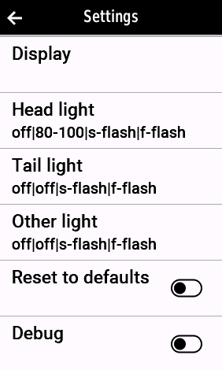
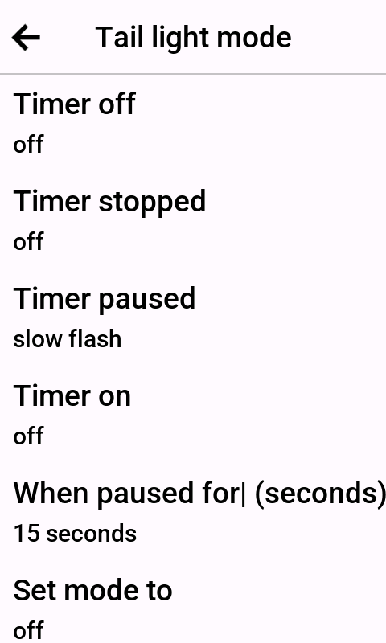
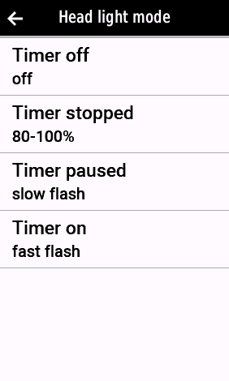
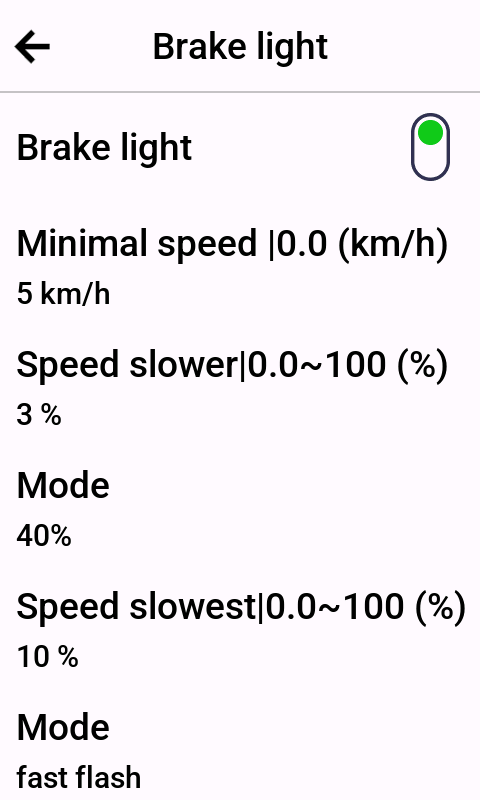
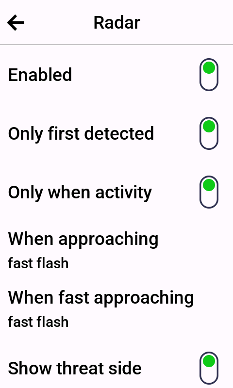

# Settled

Connect IQ datafield for saving the state of a headlight/taillight, like Varia™ RTL515 or Varia™ UT800.

Set different light modes per timerstatus:

- (Activity) Timer off
- Timer stopped
- Timer paused
- Timer on

Simulate brakelight, the backlight will flash / shine brighter when speed is slowing. 

# Settings 

Settings are on device.

- Display: what information is shown on datafield
- Head light: set mode based on timerstatus.
- Tail light: set mode based on timerstatus.
- Other light: set mode based on timerstatus.

## Display

- Show connected lights
- Show derailleur index/size

## Light modes

Set light modes for a head light, tail light or other light.

Default values are:

- Timer off : light off
- Timer stopped : light off
- Timer paused: slow flash
- Timer on: fast flash
Option to set different mode after timer paused for x seconds.

Note, after connected to the lights, only the allowed modes are selectable.

## Brake light

When speed goes slower turn backlight on with specified light mode.
Current example: 
- when speed slowing 3%-10% show brigher backlight
- when speed slowing above 10% show fast flash backlight

This can be in combination of backlight for TimerOn is on 20% or turned off.

When enabled:

- Minimal speed: when brake light is active.
- Speed slower: percentage difference between current and previous speed (1 second interval). Ex: 3%;
- Mode: define the tail lightmode. Ex: 40%

- Speed slowest: percentage difference between current and previous speed (1 second interval). Ex: 10% (brake more)
- Mode: define the tail lightmode. Ex: Fast flash

# Radar 

Enable the radar setting to fix the issue when the backlight is turned off (but radar still working). When a car is detected there is no flashing of the backlight.

When enabled, it will fast flash (or other mode you want) when a car is detected.

- Only first detected: when enabled will flash only 1 time when a new car is detected. When disabled will flash while cars are detected.
- Only when activity: when enabled will only flash when timer is on (activty is on).

